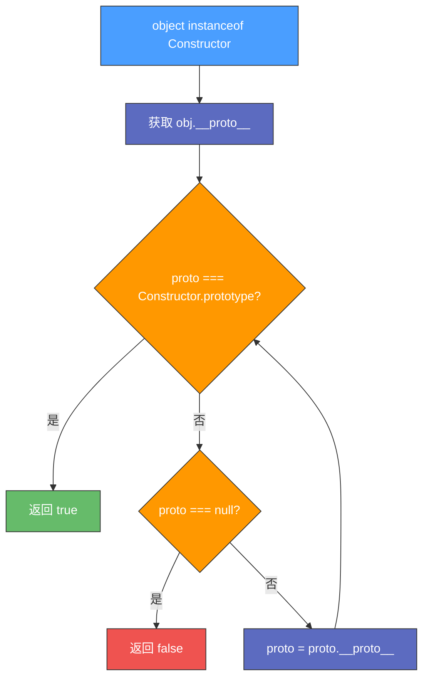

# 深入理解 JavaScript 中的 instanceof

---

## 第一部分：概念介绍

### 1. instanceof 的作用

`instanceof` 用于检查构造函数的 `prototype` 是否出现在对象的原型链上。

```javascript
object instanceof Constructor
```

| 返回值 | 说明 |
|:---:|---|
| `true` | `object` 是 `Constructor` 的实例 |
| `false` | `object` 不是 `Constructor` 的实例 |

### 2. instanceof 的工作原理

`instanceof` 通过遍历 `object` 的原型链，检查 `Constructor.prototype` 是否存在于其中。

**详细步骤**：

| 步骤 | 操作 |
|:---:|---|
| a | 取 `object` 的 `__proto__`（即 `Object.getPrototypeOf(object)`） |
| b | 依次向上查找原型链，直到找到 `Constructor.prototype`，返回 `true` |
| c | 如果原型链查找到 `null` 仍未匹配，则返回 `false` |



### 3. 示例代码

```javascript
function Animal() {}
function Cat() {}

Cat.prototype = new Animal();

var cat = new Cat();

console.log(cat instanceof Cat);    // true
console.log(cat instanceof Animal); // true
```

**分析**：

- `cat instanceof Cat` 返回 `true`，因为 `Cat.prototype` 在 `cat` 的原型链上
- `cat instanceof Animal` 也返回 `true`，因为 `Animal.prototype` 也是 `cat` 原型链上的一部分

---

## 第二部分：手写 instanceof

### 实现自定义 myInstanceOf 方法

```javascript
function myInstanceOf(obj, constructor) {
  // 获取 obj 的原型，即 __proto__
  let proto = Object.getPrototypeOf(obj); 
  
  // 遍历原型链，直到找到匹配的 prototype 或者到达原型链的尽头
  while (proto) {
    // 如果当前原型与 constructor.prototype 相等，则返回 true
    if (proto === constructor.prototype) {
      return true;
    }
    // 继续沿着原型链向上查找
    proto = Object.getPrototypeOf(proto); 
  }
  
  // 如果遍历完整个原型链仍未找到匹配的 prototype，则返回 false
  return false;
}
```

### 测试案例

```javascript
console.log(myInstanceOf(cat, Cat));    // true
console.log(myInstanceOf(cat, Animal)); // true
console.log(myInstanceOf(cat, Object)); // true
console.log(myInstanceOf(cat, Array));  // false
```

---

## 第三部分：instanceof 的局限性

### 1. 仅适用于引用类型

`instanceof` 不能用于检查基本数据类型。

```javascript
console.log(5 instanceof Number);       // false
console.log('hello' instanceof String); // false
```

### 2. 原型链过深会影响性能

由于 `instanceof` 需要遍历整个原型链，原型链层级较深时，可能会导致性能问题。

### 3. Object.create(null) 的特殊情况

`Object.create(null)` 创建的对象没有原型，因此 `instanceof` 对其无效。

```javascript
let obj = Object.create(null);
console.log(obj instanceof Object); // false
```

### 4. 使用 Symbol.hasInstance 自定义 instanceof 逻辑

JavaScript 允许使用 `Symbol.hasInstance` 修改 `instanceof` 的行为。

```javascript
class CustomClass {
  static [Symbol.hasInstance](instance) {
    return instance.customProperty === true;
  }
}

let obj = { customProperty: true };
console.log(obj instanceof CustomClass); // true
```

---

## 第四部分：拓展思考

### 1. instanceof 与 constructor 对比

另一种判断对象类型的方式是检查 `constructor`：

```javascript
console.log(cat.constructor === Cat);    // true
console.log(cat.constructor === Animal); // false
```

> ⚠️ **注意**：`constructor` 可能会被修改，从而影响判断的准确性。

### 2. instanceof 与 Object.prototype.toString.call 对比

对于基本数据类型，使用 `Object.prototype.toString.call` 更加可靠：

```javascript
console.log(Object.prototype.toString.call(5));  // [object Number]
console.log(Object.prototype.toString.call([])); // [object Array]
```

### 3. 类型判断方法对比

| 方法 | 适用场景 | 局限性 |
|---|---|---|
| `typeof` | 基本类型判断 | 无法区分对象类型，`null` 返回 `"object"` |
| `instanceof` | 引用类型判断 | 不适用于基本类型，跨 iframe 失效 |
| `constructor` | 引用类型判断 | 可被修改，不可靠 |
| `Object.prototype.toString.call` | 所有类型 | 写法较长 |

---

## 第五部分：总结与练习

### 1. 课程总结

| 知识点 | 内容 |
|---|---|
| **instanceof 作用** | 检查对象的原型链是否包含某个构造函数的 `prototype` |
| **适用范围** | 引用类型，不适用于基本数据类型 |
| **手写实现** | 通过 `myInstanceOf` 深入理解其原理 |
| **局限性** | 性能问题、`Object.create(null)` 等特殊情况 |
| **自定义行为** | `Symbol.hasInstance` 可用于修改 `instanceof` 的行为 |

### 2. 练习题

1. 编写一个 `myInstanceOf` 方法，并测试以下代码：

```javascript
function Person() {}
let p = new Person();

console.log(myInstanceOf(p, Person)); // true
console.log(myInstanceOf(p, Object)); // true
console.log(myInstanceOf(p, Array));  // false
```

2. 如何判断 `null` 和 `undefined` 是否是某个构造函数的实例？
3. `instanceof` 在 ES6 `class` 语法中的应用是什么？
4. 为什么 `Object.create(null)` 的实例不会通过 `instanceof` 检测？
5. 使用 `Symbol.hasInstance` 自定义 `instanceof` 逻辑，使 `obj instanceof CustomClass` 始终返回 `true`

---

## 附录：参考资料

- [MDN: instanceof](https://developer.mozilla.org/zh-CN/docs/Web/JavaScript/Reference/Operators/instanceof)
- 《JavaScript 高级程序设计》第四版
- 《你不知道的 JavaScript》
