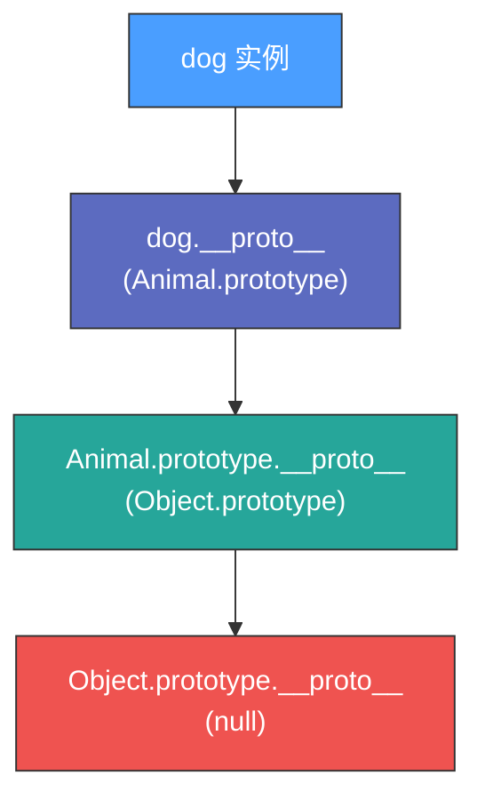
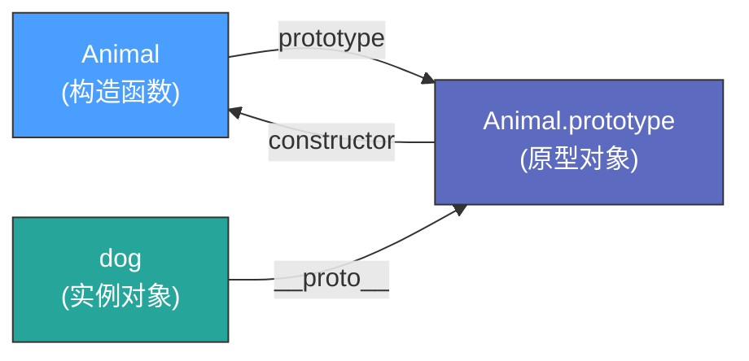

# 深入理解 JavaScript 中的原型

---

## 什么是原型？

原型是 JavaScript 中的一个核心概念，JavaScript 中所有的对象都有一个内置属性，称为它的**原型**，它是 JavaScript 实现继承和共享方法的机制。

---

## 1. 原型的本质

在 JavaScript 中，每个函数（包括构造函数）都有一个**显式原型 `prototype`** 属性。显式原型 `prototype` 指向一个对象，这个对象就是**原型对象**。

> 💡 思考一下，函数是对象吗？

- 这个原型对象可以提供方法和属性，供其他对象继承和使用
- 它本身是一个对象，原型对象会有它自己的隐式原型 `__proto__` 属性
- 在向上查找的过程中逐渐构成了**原型链**
- 原型链终止于 `null`，也就是 `Object.prototype.__proto__ === null`

```javascript
// 示例：Animal.prototype 是 Animal 构造函数的原型对象
function Animal() {}

// 它默认有一个 constructor 属性，指向 Animal 本身
console.log(Animal.prototype.constructor === Animal); // true
```

---

## 2. 对象的 `__proto__`

每个对象都有一个**隐式原型（`__proto__`）**隐藏属性，它指向创建该对象的构造函数的 `prototype`。

> 📖 **红宝书原文**：每次调用构造函数创建的一个新实例，这个实例的内部有一个 `[[Prototype]]` 指针就会被赋值为构造函数的原型对象。因为 JavaScript 脚本中没有访问这个 `[[Prototype]]` 特性的标准方式，但是 Firefox、Safari 和 Chrome 会在每个对象上暴露 `__proto__` 属性，通过这个属性可以访问对象的原型。

```javascript
function Animal() {}
let dog = new Animal();

// dog.__proto__ 指向 Animal.prototype
console.log(dog.__proto__ === Animal.prototype); // true

// Animal.prototype 是 dog 这个实例的原型
```

---

## 3. 原型的作用

原型的最大作用是**共享属性和方法**，使得所有通过相同构造函数创建的实例对象可以共享相同的方法，而不是为每个实例都创建新的方法。

```javascript
function Animal(name) {
  this.name = name;
}

// sayHello 方法只在 Animal.prototype 上定义了一次
Animal.prototype.sayHello = function() {
  console.log(`Hello, I'm ${this.name}`);
};

let dog1 = new Animal('Dog1');
let dog2 = new Animal('Dog2');

// 所有 Animal 的实例都可以通过原型链访问该方法
dog1.sayHello(); // Hello, I'm Dog1
dog2.sayHello(); // Hello, I'm Dog2

// 而不是为每个实例都创建一个新的方法
console.log(dog1.sayHello === dog2.sayHello); // true
```

**优势**：节省了内存，并提高了代码复用性。

---

## 4. 原型链

如果一个对象没有某个属性或方法，JavaScript 引擎会沿着**原型链（Prototype Chain）**向上查找，直到找到该属性或方法，或者直到 `null` 为止（即到达原型链的顶端）。

```javascript
function Animal() {}
let dog = new Animal();

// 查找过程：
// 1. dog.toString() 在 dog 对象本身找不到
// 2. dog.__proto__（即 Animal.prototype）上也没有 toString 方法
// 3. 继续查找 Animal.prototype.__proto__（即 Object.prototype）
// 4. 这里找到了 toString 方法，最终执行 Object.prototype.toString()

console.log(dog.toString()); // [object Object]
```



---

## 5. 原型的 constructor 属性

`prototype` 对象默认有一个 `constructor` 属性，指向其关联的构造函数。

```javascript
function Animal() {}
let dog = new Animal();

// constructor 属性可以用于创建新的实例
console.log(dog.constructor === Animal); // true

// 因此可以通过 new dog.constructor('Max') 创建一个新实例
let newDog = new dog.constructor();
```

---

## 6. 修改 prototype 的注意事项

如果直接修改 `prototype`，需要**手动修正 `constructor`**，否则 `constructor` 会指向错误的对象。

### ❌ 错误示例

```javascript
function Animal() {}

Animal.prototype = {
  sayHello: function() {
    console.log('Hello');
  }
};

let dog = new Animal();
console.log(dog.constructor === Animal); // false ❌
console.log(dog.constructor === Object); // true（指向了 Object）
```

### ✅ 修正方式

```javascript
Animal.prototype = {
  constructor: Animal, // 手动修正 constructor
  sayHello: function() {
    console.log('Hello');
  }
};

let dog = new Animal();
console.log(dog.constructor === Animal); // true ✅
```

---

## 7. 原型 vs `__proto__` vs prototype 的区别

| 术语 | 作用 |
|---|---|
| **prototype** | 构造函数的属性，指向该构造函数创建的对象的原型 |
| **`__proto__`** | 对象的属性，指向创建该对象的构造函数的 `prototype` |
| **constructor** | `prototype` 的默认属性，指向构造函数本身 |

### 关系示意图

```javascript
function Animal() {}
let dog = new Animal();

console.log(dog.__proto__ === Animal.prototype);          // true
console.log(Animal.prototype.constructor === Animal);     // true
```



---

## 预告：原型链的应用

- **原型链**允许对象继承来自构造函数 `prototype` 的方法和属性
- 对象的 `__proto__` 指向其构造函数的 `prototype`，形成层层查找的原型链
- `instanceof` 通过原型链检查对象是否为某个构造函数的实例：

```javascript
console.log(dog instanceof Animal); // true
console.log(dog instanceof Object); // true
```
