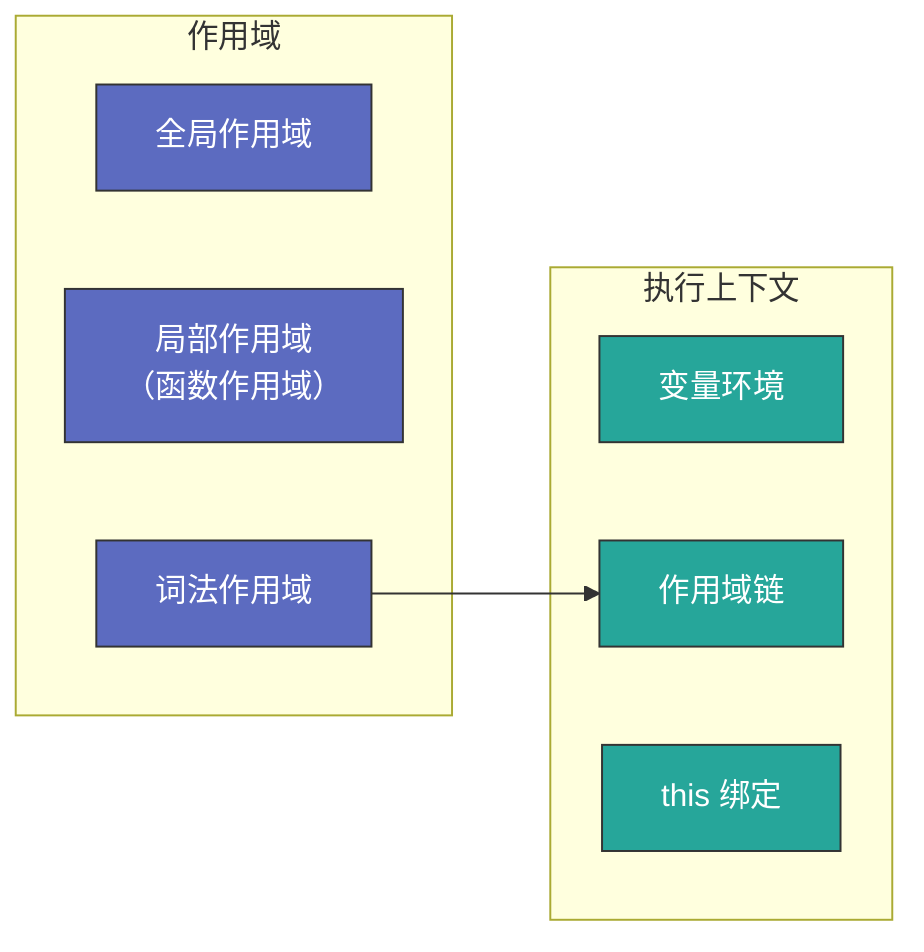
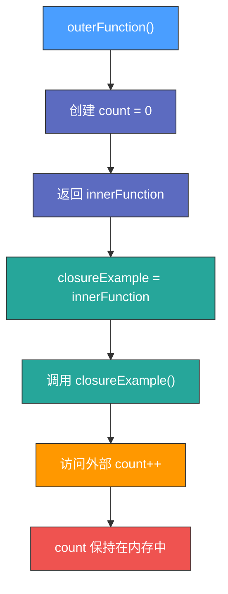

# 深入理解 JavaScript 中的闭包

---

## 第一部分：闭包的概念

### 1. 什么是闭包？

| 来源 | 定义 |
|---|---|
| **红宝书** | 闭包是指有权访问另一个函数作用域中变量的函数 |
| **MDN** | 闭包是指那些能够访问自由变量的函数，这里的自由变量是指外部作用域中的变量 |

### 2. 相关知识点



### 3. 示例代码

```javascript
function outerFunction() {
  let count = 0; // 变量 count 在 outerFunction 内部，是一个自由变量
  
  return function innerFunction() { // innerFunction 是一个闭包
    count++; // 闭包访问了外部函数的变量 count
    console.log(count); // 输出 count 的值
  };
}

const closureExample = outerFunction(); // 执行 outerFunction，返回 innerFunction
closureExample(); // 1  第一次调用，count 变为 1
closureExample(); // 2  第二次调用，count 变为 2（count 变量仍然存在）
```

**分析**：

- `innerFunction` 访问了 `outerFunction` 内部的 `count` 变量
- `count` 变量不会被垃圾回收，因为 `innerFunction` 仍然持有对其的引用



---

## 第二部分：闭包的优缺点

### 1. 闭包的优点

| 优点 | 说明 |
|---|---|
| **数据私有化** | 避免变量污染，提高代码安全性 |
| **维持状态** | 在多次执行时保持变量值，例如防抖、节流 |

#### 示例：防抖（debounce）

```javascript
function debounce(fn, delay) {
  let timer = null; // timer 变量用于存储定时器 ID，实现私有化
  
  return function () { // 返回一个闭包，保持对 timer 变量的访问
    let context = this, args = arguments; // 保存 this 上下文和参数
    
    if (timer) { // 如果已有定时器，则清除
      clearTimeout(timer);
    }
    
    timer = setTimeout(() => { // 设置新的定时器
      fn.apply(context, args); // 延迟执行目标函数
    }, delay);
  };
}
```

**分析**：

- `timer` 变量在 `debounce` 内部，只能被返回的函数访问，避免了全局变量污染
- 每次调用时 `timer` 保持最新状态，实现防抖效果

### 2. 闭包的缺点

| 缺点 | 说明 |
|---|---|
| **可能导致内存泄漏** | 由于闭包引用外部变量，可能导致垃圾回收机制无法回收 |

#### 内存泄漏示例

```javascript
function assignHandler() {
  var element = document.getElementById('root'); // 获取 DOM 元素
  
  element.onclick = function () { // 绑定点击事件
    alert(element.id); // 访问外部作用域变量 element
  };
  
  // element = null; // 释放引用，防止内存泄漏
}
```

**分析**：

- `element` 被 `onclick` 持有，导致无法被垃圾回收
- **解决方案**：在不需要时手动置 `element = null`

### 3. 垃圾回收机制

| 机制 | 说明 |
|---|---|
| **标记清除** | 标记不再使用的变量，定期清理 |
| **引用计数** | 当变量的引用数降为 0 时，自动回收 |
| **新生代 & 老生代** | V8 引擎采用分代回收策略，提高性能 |

---

## 第三部分：闭包的实际应用

### 1. Vue 响应式原理

Vue 通过 **闭包 + 依赖收集** 实现响应式。

```javascript
function reactive(obj) {
  return new Proxy(obj, { // 创建 Proxy 代理对象
    get(target, key) {
      console.log(`读取 ${key}`);
      return target[key]; // 读取对象属性
    },
    set(target, key, value) {
      console.log(`更新 ${key} -> ${value}`);
      target[key] = value; // 更新对象属性
      return true;
    }
  });
}

let data = reactive({ count: 0 });
data.count++; // 读取 count -> 更新 count -> 1
```

### 2. React Hooks（useState）

`useState` 利用闭包存储状态。

```javascript
function useState(initialValue) {
  let state = initialValue; // 闭包变量 state
  
  function setState(newValue) {
    state = newValue; // 更新 state
    console.log("State updated to:", state);
  }
  
  return [() => state, setState]; // 返回 getter 和 setter
}

const [getState, setState] = useState(0);
console.log(getState()); // 0
setState(5);
console.log(getState()); // 5
```

---

## 第四部分：面试答题策略

> **问题**：什么是闭包？闭包有什么作用？
>
> **回答**：闭包是指有权访问另一个函数作用域中变量的函数。它的优点是可以实现数据私有化，如防抖、节流，持久化变量状态；但如果使用不当，可能导致内存泄漏，比如 DOM 事件回调函数持有外部变量导致的引用问题。常见的应用场景包括 Vue 响应式、React Hooks、事件绑定等。

---

## 第五部分：总结与练习

### 1. 课程总结

| 知识点 | 内容 |
|---|---|
| **闭包的概念** | 访问外部作用域变量的函数 |
| **作用域与执行上下文** | 决定变量的可访问性 |
| **闭包的优缺点** | 数据私有化 vs. 内存泄漏 |
| **应用场景** | 防抖、节流、Vue 响应式、React Hooks |
| **面试策略** | 结构化回答，逻辑清晰 |

### 2. 练习题

1. 实现 `throttle`（节流）函数
2. 如何避免闭包引起的内存泄漏？
3. 解释 Vue 响应式中的闭包原理
4. React Hooks 如何利用闭包管理状态？
5. `let` 关键字如何影响闭包？
