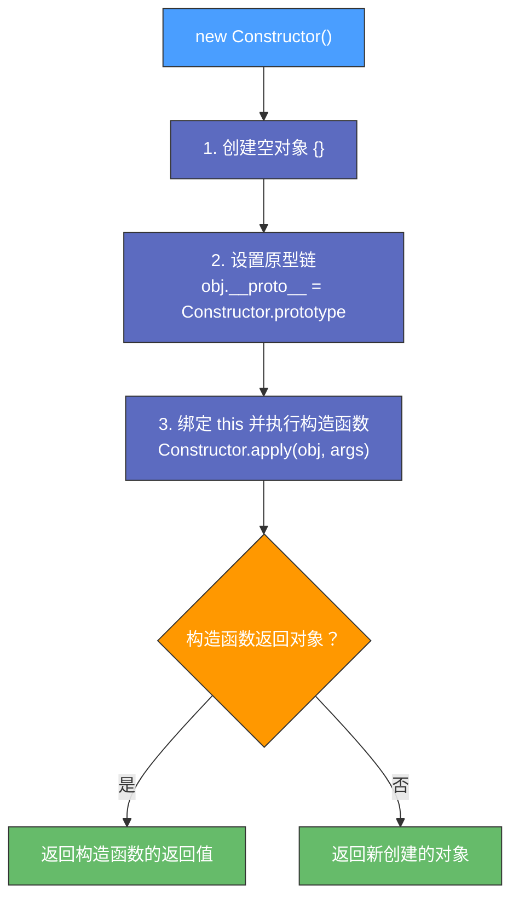

# 深入理解 JavaScript 中的 new 关键字

---

## 第一部分：new 关键字的概念

### 1. 什么是 new？

- `new` 运算符用于创建一个构造函数的实例
- 适用于用户定义的对象类型或者内置对象的实例

### 2. new 的工作流程

- `new` 关键字的作用是创建一个新对象，并将其与构造函数关联
- 语法示例：

```javascript
function Person(name, age) {
  this.name = name;
  this.age = age;
}

var john = new Person('John', 30);
console.log(john); // {name: 'John', age: 30}
```

---

## 第二部分：new 操作符的执行过程

### 1. new 具体做了哪些事情？

`new` 操作符的执行步骤如下：

1. **创建空对象**：创建一个空对象，该对象的原型指向构造函数的 `prototype`
2. **绑定 this**：将构造函数的 `this` 绑定到该空对象上，执行构造函数的代码
3. **添加属性**：执行构造函数的代码，向新对象添加属性和方法
4. **返回对象**：如果构造函数没有显式返回一个对象，则返回该新对象，否则返回构造函数显式返回的对象



### 2. 示例代码解析

```javascript
function Person(name, age) {
  this.name = name;
  this.age = age;
}

var john = new Person('John', 30);
console.log(john); // {name: 'John', age: 30}
```

**分析**：`new Person('John', 30)` 发生了以下过程：

| 步骤 | 操作 |
|:---:|---|
| a | 创建空对象 `{}` |
| b | 将 `john.__proto__` 设为 `Person.prototype` |
| c | 绑定 `this` 到 `john`，执行 `Person` 函数，赋值属性 |
| d | `Person` 没有显式返回对象，因此返回 `john` |

---

## 第三部分：手写 new 的实现

### 1. 手写 new 实现

```javascript
function myNew(Constructor, ...args) {
  // 1. 创建一个空对象，并将其原型指向构造函数的 prototype
  var obj = Object.create(Constructor.prototype);
  
  // 2. 绑定 this 并执行构造函数
  var result = Constructor.apply(obj, args);
  
  // 3. 返回新对象（如果构造函数返回的是对象，则优先返回该对象）
  return (typeof result === 'object' && result !== null) ? result : obj;
}
```

### 2. 测试手写 new 函数

```javascript
function Person(name, age) {
  this.name = name;
  this.age = age;
}

var john = myNew(Person, 'John', 30);
console.log(john); // {name: 'John', age: 30}
```

**分析**：

- `myNew` 过程与 `new` 关键字的执行过程一致
- 使用 `Object.create(Constructor.prototype)` 创建对象，确保原型链正确
- 通过 `apply` 绑定 `this` 并执行构造函数
- 处理构造函数可能返回对象的情况

---

## 第四部分：new 的应用及拓展

### 1. new 在 JavaScript 继承中的作用

- `new` 结合 `prototype` 形成原型链继承机制
- `new` 允许创建基于构造函数原型的对象

### 2. new 的局限性

| 局限性 | 说明 |
|---|---|
| 不能用于箭头函数 | 箭头函数没有 `this` 绑定 |
| 可能导致内存泄漏 | 需谨慎使用 |

### 3. class 语法如何使用 new

```javascript
class Animal {
  constructor(name) {
    this.name = name;
  }
}

const dog = new Animal('Dog');
console.log(dog); // {name: 'Dog'}
```

**分析**：`class` 本质上是 `constructor` 语法糖，执行流程与 `new` 一致。

---

## 第五部分：面试答题策略

### 1. 答题逻辑

| 步骤 | 要点 | 示例表述 |
|:---:|---|---|
| 1 | 定义 `new` 关键字的作用 | "new 关键字用于创建构造函数的实例对象。" |
| 2 | 详细阐述 `new` 的执行过程 | 创建对象 → 绑定 this → 执行构造函数 → 返回对象 |
| 3 | 说明 `new` 的应用场景 | 继承、面向对象编程 |
| 4 | 深入拓展，结合 class 语法 | new 与 class 的关系 |
| 5 | 手写 new，加深理解 | 书写 myNew 方法，并解释实现细节 |

### 2. 示例面试回答

> **问题**：new 关键字的作用是什么？
>
> **回答**：new 关键字用于创建构造函数的实例对象。其执行过程包括创建新对象、绑定 this、执行构造函数、返回新对象。在 JavaScript 继承机制中，new 结合 prototype 形成了原型链继承。此外，new 关键字是 class 语法实现面向对象编程的核心部分。

---

## 第六部分：总结与练习

### 1. 课程总结

| 知识点 | 内容 |
|---|---|
| **new 的作用** | 创建构造函数的实例 |
| **执行过程** | 创建对象 → 绑定 this → 执行构造函数 → 返回对象 |
| **手写 new** | 模拟 new 的执行流程 |
| **继承中的作用** | 原型链继承的关键 |
| **面试策略** | 答题逻辑清晰，手写 new 代码 |

### 2. 练习题

1. 编写 `myNew` 方法，并测试其正确性
2. `new` 在 `class` 语法中的作用是什么？
3. 为什么 `new` 不能用于箭头函数？
4. `new` 与 `Object.create` 的区别是什么？
5. `new` 的返回值为什么可能是一个对象？

---

## 附录：参考资料

- [MDN: new 运算符](https://developer.mozilla.org/zh-CN/docs/Web/JavaScript/Reference/Operators/new)
- 《JavaScript 高级程序设计》第四版
- 《你不知道的 JavaScript》
