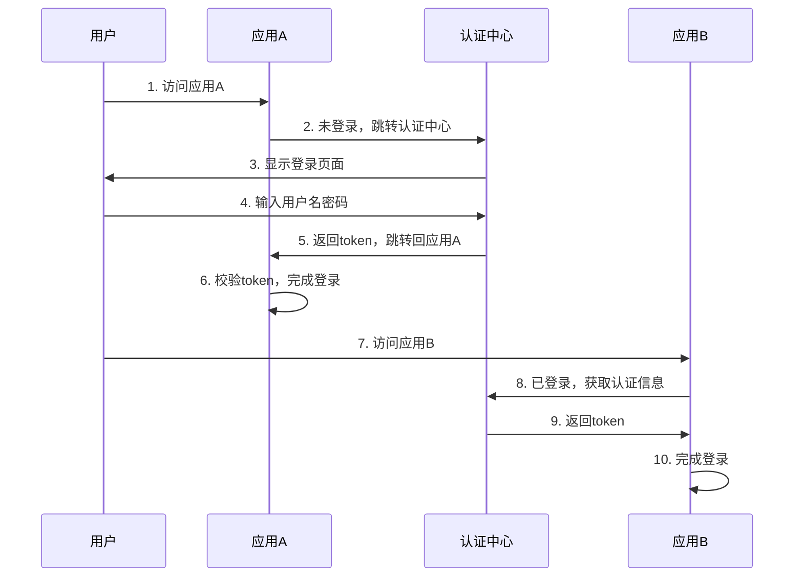
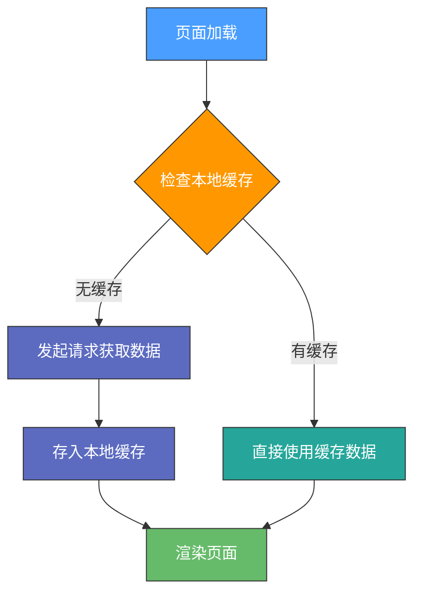
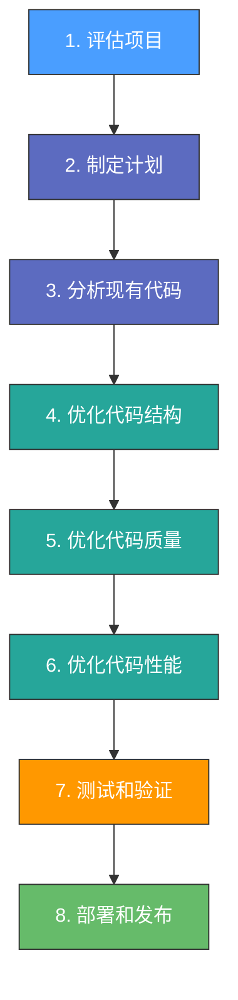

# 前端业务场景题

---

## 1. 单点登录如何做

单点登录（Single Sign-On，简称 SSO）是一种认证技术，让用户只需登录一次，即可访问多个应用系统。

### 实现流程



### 关键点

实现单点登录的关键在于**认证中心**，它需要能够对多个应用进行认证和授权，并提供统一的认证信息格式。

常见的认证中心包括：**CAS**、**OAuth** 等。

---

## 2. 函数执行拦截

> **问题**：如果想对每个 function 的执行都实现一个"拦截"效果，可以怎么做？

覆写 `Function.prototype.call` 是一种方法，但**不建议直接修改原型链**，可以使用函数代理或函数装饰器来实现。

### 方案一：函数代理

```javascript
function proxy(fn) {
  return function () {
    console.log(`Function ${fn.name} is about to execute`);
    const result = fn.apply(this, arguments);
    console.log(`Function ${fn.name} has finished executing with result:`, result);
    return result;
  }
}

function add(a, b) {
  return a + b;
}

const proxiedAdd = proxy(add);
console.log(proxiedAdd(2, 3)); 
// 输出: "Function add is about to execute" 
// 输出: "Function add has finished executing with result: 5"
```

### 方案二：函数装饰器

使用 `@` 符号来添加装饰器，自动对函数进行修饰：

```javascript
function log(target, name, descriptor) {
  const fn = descriptor.value;
  descriptor.value = function () {
    console.log(`Function ${name} is about to execute`);
    const result = fn.apply(this, arguments);
    console.log(`Function ${name} has finished executing with result:`, result);
    return result;
  };
}

class Calculator {
  @log
  add(a, b) {
    return a + b;
  }
}

const calculator = new Calculator();
console.log(calculator.add(2, 3));
```

---

## 3. 每隔 1 秒钟打印一个递增序列

> 优先采用 ES6 Promise async/await

```javascript
const sleep = (ms) => {
  return new Promise(resolve => setTimeout(resolve, ms));
}

const printSequence = async () => {
  let count = 0;
  while(true) {
    console.log(count);
    count++;
    await sleep(1000);
  }
}

printSequence();
```

### 原理说明

1. `sleep` 函数接收一个时间参数 `ms`，返回一个 Promise，使用 `setTimeout` 实现延迟
2. `printSequence` 函数通过 `async/await` 结合 Promise 实现每隔 1 秒打印
3. 使用 `await` 关键字等待 1 秒钟，然后继续执行下一次循环

---

## 4. 页面第一次加载不触发请求

> **问题**：如何在页面第一次加载不触发请求，后续每一次进入页面都触发？

### 解决方案

通过浏览器的**本地缓存技术**来实现：



### 实现方式

使用浏览器提供的 **Web Storage API**（`localStorage` 或 `sessionStorage`）：

1. 页面加载时，先检查缓存是否存在
2. 如果存在，直接使用缓存数据
3. 如果不存在，发起请求获取数据，并存入缓存

---

## 5. 如何做好前端技术选型

| 考虑因素 | 说明 |
|---|---|
| **了解需求和目标** | 要开发什么应用、目标用户、需要支持的浏览器和设备 |
| **团队技术水平** | 团队成员的技术水平和经验、公司资源情况 |
| **技术成熟度** | 是否有充足的文档和社区支持、稳定的版本和更新计划 |
| **优缺点比较** | 性能、可维护性、安全性、易用性等方面的比较 |
| **原型验证** | 快速原型开发、技术实验、性能测试 |

---

## 6. 无限滚动的内容回收

> **问题**：如果每次页面滑到底部再加载新的，那么上面的怎么回收？

### 常见优化方式

| 方式 | 说明 |
|---|---|
| **滚动缓存** | 缓存一定数量的内容，避免每次滚动都重新加载 |
| **虚拟滚动** | 只渲染可见区域内的内容，使用 `react-window` 或 `react-virtualized` |
| **懒加载** | 延迟加载页面中的部分内容，使用 `react-lazyload` |

### 虚拟滚动原理


---

## 7. 秒杀系统前端要做什么

| 工作内容 | 具体说明 |
|---|---|
| **页面设计** | 设计页面布局、交互功能和动画效果 |
| **数据交互** | 与后端进行数据交互，注意并发请求问题 |
| **业务逻辑** | 用户身份认证、商品信息获取、购买操作处理 |
| **性能优化** | 减少 HTTP 请求数、压缩文件、缓存数据 |
| **安全优化** | 防止重放攻击、恶意请求、XSS 攻击 |

---

## 8. Vue 动态菜单栏的实现

> **问题**：除了使用 `v-if` 判断角色权限进行动态渲染外还有什么其他方式？

| 方式 | 说明 |
|---|---|
| **路由配置** | 在路由配置中定义菜单项和权限，根据用户权限动态生成菜单 |
| **Vuex 状态管理** | 将菜单信息保存在 Vuex 中，根据用户权限动态生成 |
| **动态导入** | 将菜单配置存放在 JSON 文件中，根据权限动态导入组件 |

---

## 9. 如何重构前端项目

### 重构步骤



### 具体内容

| 步骤 | 内容 |
|---|---|
| **评估项目** | 了解项目规模、复杂度、技术栈和现有问题 |
| **制定计划** | 重构范围、时间表、人员安排、测试策略 |
| **分析代码** | 阅读现有代码，识别问题和潜在风险 |
| **优化结构** | 模块划分，遵循单一职责和开放封闭原则 |
| **优化质量** | 代码风格、命名规范、引入代码检查工具 |
| **优化性能** | 优化逻辑和算法，采用异步加载和懒加载 |
| **测试验证** | 单元测试、集成测试、回归测试、性能测试 |
| **部署发布** | 部署到生产环境，进行实时监控 |

---

## 10. 前端怎么定位发生错误的元素

| 方法 | 说明 |
|---|---|
| **浏览器开发者工具** | 查看控制台错误信息、DOM 结构和 CSS 样式 |
| **调试工具** | Vue Devtools、React Devtools 等框架调试工具 |
| **日志输出** | 在代码中加入日志输出语句，记录关键操作 |
| **第三方错误追踪** | Sentry、Bugsnag 等工具自动捕获和分析错误 |

---

## 11. 虚拟列表的原理

### 实现步骤

1. 计算列表容器的高度以及每条数据的高度
2. 根据容器高度和每条数据的高度计算可见区域内需要展示的数据数量
3. 根据当前滚动条的位置，计算需要渲染的数据的起始位置和结束位置
4. 在滚动容器中渲染对应的数据项
5. 监听滚动事件，动态渲染

> ⚠️ **注意**：虚拟列表需要进行大量的数学计算和 DOM 操作，需要特别注意性能问题。

---

## 12. 如何介绍项目的背景

### 回答模板

> 首先，我来介绍一下这个项目的**背景和目的**。该项目是为了 XXX（填写项目目标），主要面向 XXX（填写使用人群）。通过该项目，我们希望能够 XXX（填写预期效果）。
>
> 接下来，我来具体讲一下我们**如何完成这个项目**。在技术选型方面，我们采用了 XXX（填写技术架构）。在开发流程上，我们采用了敏捷开发的方法。在实现过程中，我们遇到了一些难点，比如 XXX（填写具体问题），但我们通过 XXX（填写解决方案），最终成功完成了该项目。
>
> 总的来说，该项目对我来说是一次非常宝贵的经验，让我学到了 XXX（填写技能），并且也提高了我的**团队协作能力**。

---

## 13. HTTP/1 一定比 HTTP/2 慢吗？

**不一定**。HTTP/2 在某些情况下会更快，但在某些情况下会更慢。

### HTTP/2 的优势

| 特性 | 说明 |
|---|---|
| **多路复用** | 同一连接上同时发送多个请求和响应，避免队头阻塞 |
| **头部压缩** | 减小请求和响应的大小，减少网络带宽占用 |
| **服务器推送** | 服务器主动推送资源，避免二次请求 |
| **TCP 优化** | 更好地处理 TCP 的延迟和拥塞控制 |

### HTTP/1.1 可能更快的情况

- 旧浏览器和服务器可能不支持 HTTP/2
- 对于只有少量请求的小型网站

---

## 14. npm、yarn、pnpm 的优缺点

| 工具 | 优点 | 缺点 |
|---|---|---|
| **npm** | 稳定、安全、易于使用 | 速度较慢、占用磁盘空间多 |
| **yarn** | 速度快、可靠性高、支持离线模式 | 可能有兼容性问题 |
| **pnpm** | 占用磁盘空间少、支持多版本共存 | 安装速度稍慢、学习成本 |

### 为什么 pnpm 更好？

pnpm 采用**链接的方式来共享依赖包**，而不是在每个项目中都安装一份依赖包，因此可以节省大量磁盘空间。

---

## 15. 微前端主要解决了哪些痛点？

| 痛点 | 解决方案 |
|---|---|
| **大型应用的可维护性** | 将大型应用拆分成多个小型应用，独立开发、测试和部署 |
| **多团队协同开发** | 每个应用可以由不同团队独立开发和部署 |
| **前端应用的可扩展性** | 每个应用可以独立开发和部署，提高可扩展性 |
| **前端应用的性能** | 每个应用可以独立更新，无需重新加载整个页面 |
| **前端技术栈多样化** | 每个应用可以使用不同的技术栈 |
