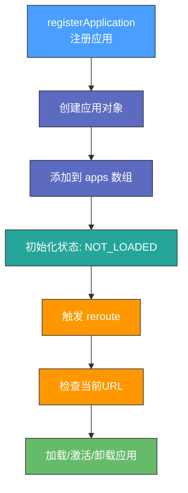
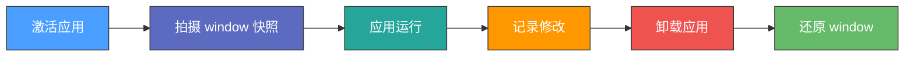
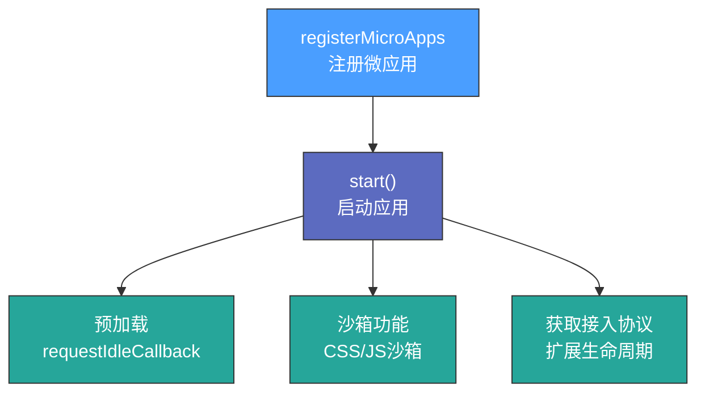

# 微前端架构详解

> 📦 项目 GitHub 地址：https://github.com/DevWizardFeng/MicroFrontendLab/tree/main

---

## 项目亮点

- 微前端概念及应用
- SystemJS 源码
- single-spa 实战及源码
- qiankun 实战及源码（沙箱原理）- 蚂蚁金服
- MicroApp、WebComponent 实战及源码 - 京东零售
- wujie 实战使用 - 腾讯
- Webpack5 Module Federation Emp2 实战

---

## 一、为什么需要微前端

> 微前端就是将不同的功能按照不同的维度拆分成多个子应用，通过主应用来加载这些子应用。

**对比案例**：DeepTable、DeepUx、DeepModel、DeepFlow、DeepBI

> 💡 微前端的核心在于**拆**，拆完后再**合**，实现分而治之！

### 1. 微前端解决的问题

| 问题 | 说明 |
|---|---|
| **技术栈不同** | 不同团队同时开发一个应用 |
| **独立部署** | 每个团队开发的模块都可以独立开发、独立部署 |
| **增量迁移** | 实现渐进式的系统升级 |

### 2. 如何实现微前端

将一个应用划分成若干个子应用，将子应用打包成一个个的模块。当路径切换时加载不同的子应用。这样每个子应用都是独立的，技术栈也不用做限制了！

### 3. 实现微前端的技术方案

需要考虑的问题：
- 采用何种方案进行应用拆分？
- 采用何种方式进行应用通信？
- 应用之间如何进行隔离？

#### 方案对比

| 方案 | 优点 | 缺点 |
|---|---|---|
| **iframe** | 完美的沙箱机制，自带应用隔离 | 用户体验差（弹框只能在 iframe 中、刷新丢失状态） |
| **Web Components** | Shadow DOM 天生作用域隔离 | 浏览器兼容性、学习成本、调试困难 |
| **single-spa** | 路由劫持实现应用加载，提供公共组件加载 | 无沙箱机制，需要自己实现 JS/CSS 沙箱 |
| **Module Federation** | 模块联邦，共享模块通信 | 需要 Webpack5，无 CSS/JS 沙箱 |

### 4. Why Not Iframe？

> 如果不考虑体验问题，iframe 几乎是最完美的微前端解决方案。

**iframe 的问题**：

| 问题 | 说明 |
|---|---|
| **URL 不同步** | 浏览器刷新 iframe url 状态丢失、后退前进按钮无法使用 |
| **UI 不同步** | DOM 结构不共享，弹框无法居中显示 |
| **全局上下文隔离** | 内存变量不共享，cookie 透传困难 |
| **性能问题** | 每次子应用进入都是浏览器上下文重建、资源重新加载 |

---

## 二、SystemJS 剖析

> SystemJS 是一个通用的模块加载器，它能在浏览器上动态加载模块。

微前端的核心就是**加载微应用**，我们将应用打包成模块，在浏览器中通过 SystemJS 来加载模块。

---

## 三、single-spa 实战

### 1. 安装脚手架

```bash
npm install create-single-spa -g
create-single-spa substrate  # 通过 single-spa-cli 创建基座应用
```

创建选项：
- `single-spa application / parcel` - 创建子项目
- `in-browser utility module` - 用于跨应用共享 JavaScript 逻辑的微应用
- `single-spa root config` - 创建基座容器

### 2. 生成 React 子应用

```bash
create-single-spa react-project
npm install react-router-dom
```

#### webpack.config.js 配置

在 `index.ejs` 和 `jw-root-config.js` 中注册子应用。

### 3. 生成 Vue 子应用

```bash
create-single-spa vue-project
```

#### vue.config.js 配置

在 `substrate/index.ejs` 中添加路由跳转，然后启动三个项目即可看到效果。

---

## 四、single-spa 源码解析

### 1. 核心功能回顾

```html
<script src="https://cdn.bootcdn.net/ajax/libs/single-spa/5.9.3/umd/single-spa.min.js"></script>
```

single-spa 的核心功能：
- **注册应用** `registerApplication`
- **启动应用** `start`
- **生命周期**：`bootstrap`、`mount`、`unmount`（必须实现），`unload`（可选）

### 2. 核心方法实现

#### app.js 的主要作用



#### app.helpers.js 状态定义

| 状态 | 说明 |
|---|---|
| `NOT_LOADED` | 未加载 |
| `LOADING_SOURCE_CODE` | 加载中 |
| `NOT_BOOTSTRAPED` | 未启动 |
| `NOT_MOUNTED` | 未挂载 |
| `MOUNTED` | 已挂载 |

#### 生命周期管理

| 文件 | 作用 |
|---|---|
| **bootstrap.js** | 处理应用启动流程，执行 `bootstrap` 方法 |
| **load.js** | 处理应用加载流程，加载应用代码 |
| **mount.js** | 处理应用挂载流程，执行 `mount` 方法 |
| **unmount.js** | 处理应用卸载流程，执行 `unmount` 方法 |

#### navigation-event.js 导航系统

主要作用：
- **劫持路由事件**：监听 `hashchange` 和 `popstate` 事件
- **重写事件监听器**：控制 `addEventListener` 和 `removeEventListener`
- **拦截历史 API**：对 `pushState` 和 `replaceState` 进行补丁

---

## 五、qiankun 从入门到实战

### 1. 创建 React 主应用（Substrate）

```bash
npx create-react-app substrate
cd substrate
npm install qiankun
```

在 `src/App.js` 中配置乾坤，注册子应用并启动。

### 2. 创建 React 子应用（m-react）

```bash
npx create-react-app m-react
npm install @rescripts/cli
```

> `@rescripts/cli` 允许你在不需要 'eject' 的情况下，自定义 Create React App 的 webpack 配置。

#### 关键配置

| 文件 | 内容 |
|---|---|
| **package.json** | 使用 `@rescripts/cli` |
| **.rescriptsrc.js** | 配置 webpack，输出 UMD 格式 |
| **src/index.js** | 暴露生命周期给乾坤 |
| **src/public-path.js** | 动态设置 publicPath |
| **.env** | `PORT=40000`、`WDS_SOCKET_PORT=40000` |

### 3. 创建 Vue 子应用（m-vue）

```bash
vue create m-vue
```

#### vue.config.js 配置

```javascript
module.exports = {
  devServer: {
    headers: {
      'Access-Control-Allow-Origin': '*',
    },
  },
  configureWebpack: {
    output: {
      library: 'm-vue',
      libraryTarget: 'umd',
    },
  },
}
```

### 4. 动态加载 static 子应用

对于非 webpack 构建的项目（如 jQuery、jsp），可以通过 `loadMicroApp` 动态加载。

```bash
http-server -p 30000 --cors  # 通过 http-server 启动静态资源
```

### 5. 主子应用间通讯

使用 `initGlobalState` 在主应用定义全局状态，微应用通过 props 获取通信方法。

### 6. 样式隔离

| 模式 | 说明 | 缺点 |
|---|---|---|
| **experimentalStyleIsolation** | 动态添加属性，重写 CSS 选择器 | 性能影响，动态插入样式可能失效 |
| **strictStyleIsolation** | 使用 Shadow DOM 封装 | 浏览器兼容性，子应用 DOM 挂载到外层样式失效 |

### 7. Web Components

Web Components 由三个主要技术组成：

| 技术 | 说明 |
|---|---|
| **Custom Elements** | 创建自定义 HTML 标签 |
| **Shadow DOM** | 封装内部结构、样式和行为 |
| **HTML Templates** | `<template>` 和 `<slot>` 定义可复用结构 |

---

## 六、qiankun JS 沙箱原理

### 1. 代理沙箱（Proxy Sandbox）

使用 Proxy 对象创建虚拟全局环境，微应用对全局环境的修改只影响代理对象。

### 2. 快照沙箱（Snapshot Sandbox）

在微应用激活时对全局环境进行"快照"，卸载时还原到快照状态。



### 3. 沙箱类型对比

| 类型 | 特点 | 适用场景 |
|---|---|---|
| **SnapshotSandbox** | 基于快照，浪费内存 | 单例模式 |
| **LegacySandbox** | 基于 Proxy，节约内存 | 单例模式 |
| **ProxySandbox** | 多个 fakeWindow 实例 | 多实例模式 |

---

## 七、qiankun-master 源码解析

### 核心方法



### 流程总结

1. 注册采用 single-spa，`start()` 也是 single-spa
2. 预加载利用空闲时间 `requestIdleCallback`
3. 沙箱功能：CSS 沙箱 + 样式隔离（Shadow DOM、scopedCSS）
4. 使用 `import-html-entry` 替代 SystemJS 进行文件加载解析
5. 沙箱降级方案 `autoDowngradeForLowVersionBrowser`

### qiankun 存在的问题

| 问题 | 解决方案 |
|---|---|
| **依赖复用** | 共享模块打包到 CDN，或使用 Module Federation |
| **组件复用** | 将组件单独打包为 NPM 包或部署到 CDN |
| **Vite 支持** | 生产环境接入 Vite，或使用插件转换模块格式 |
| **嵌套问题** | 避免多重沙箱嵌套，在子应用中关闭沙箱 |
| **CSS 沙箱** | strictStyleIsolation 完全隔离，样式无法传递到子应用 |

---

## 八、MicroApp 使用

> [MicroApp 官网](https://micro-zoe.github.io/micro-app/) - 京东零售团队打造

### 1. 基座应用配置

```bash
npm install @micro-zoe/micro-app --save
```

```javascript
// 在基座应用中引入 microApp 并初始化
import microApp from '@micro-zoe/micro-app'
microApp.start()
```

### 2. 嵌入子应用

```jsx
// Vue 子应用组件
<micro-app name='vue-app' url='http://localhost:3001/' baseroute='/vue'></micro-app>

// React 子应用组件
<micro-app name='react-app' url='http://localhost:3002/' baseroute='/react'></micro-app>
```

### 3. 子应用改造

#### Vue 子应用

```javascript
// vue.config.js 跨域支持
module.exports = {
  devServer: {
    headers: {
      'Access-Control-Allow-Origin': '*',
    },
  },
}
```

#### React 子应用

创建 `public-path.js` 并在 `index.js` 中引入。

### 4. MicroApp 基于 WebComponent 实现

| 技术 | 说明 |
|---|---|
| **Custom Elements** | 定义自己的 HTML 标签 |
| **Shadow DOM** | 封装元素的标记和样式 |
| **HTML Templates** | `<template>` 和 `<slot>` 标签 |
| **生命周期** | `connectedCallback`、`disconnectedCallback` 等 |

### MicroApp 核心特性

1. **WebComponent 组件创建**：每个微应用作为自定义元素存在
2. **HTML 模板处理**：微应用 HTML 放置到对应 WebComponent 中
3. **CSS 作用域隔离**：通过 CSS Scoping 确保样式隔离
4. **JavaScript 沙箱环境**：通过 Proxy 创建隔离上下文
5. **兼容 qiankun**：支持 qiankun 改造的子应用

---

## 九、wujie 的实现和使用

> wujie 采用 **WebComponent + iframe** 的沙箱模式

### 1. 基座配置

```javascript
// src/components/wujie-react.js
import { startApp, setupApp } from 'wujie'

// 封装 wujie-react 组件
```

### 2. 子应用配置

```javascript
// m-vue 子应用加上 webpack 跨域改造
module.exports = {
  devServer: {
    headers: {
      'Access-Control-Allow-Origin': '*',
    },
  },
}
```

---

## 十、Webpack5 模块联邦与 EMP2 实践

### 1. 基础知识

#### EMP2

emp2 是一个用于构建企业级微前端应用的框架，允许将大型前端应用分解为独立的模块。

#### Module Federation

| 概念 | 说明 |
|---|---|
| **动机** | 不同开发小组间共同开发一个或多个应用 |
| **容器** | 每个应用块是独立构建，编译为容器 |
| **remote** | 被引用的容器，暴露模块给 host |
| **host** | 引用者，使用 remote 暴露的模块 |

#### 配置参数

| 字段 | 类型 | 含义 |
|---|---|---|
| `name` | string | 输出的模块名 |
| `filename` | string | remoteEntry 文件名 |
| `remotes` | object | 其他应用的引用映射 |
| `exposes` | object | 当前应用暴露给其他应用的模块 |
| `shared` | object | 应用程序之间共享的模块 |

### 2. webpack-chain

webpack-chain 是一个用于创建和修改 Webpack 配置的 Node.js 库，提供链式 API。

```javascript
const WebpackChain = require('webpack-chain');
const config = new WebpackChain();

config
  .entry('app')
    .add('./src/index.js')
    .end()
  .output
    .path('/dist')
    .filename('bundle.js');
```

### 3. 相关工具

| 工具 | 说明 |
|---|---|
| `@babel/core` | Babel 核心编译器 |
| `@babel/preset-env` | 根据目标环境自动确定 Babel 插件 |
| `@babel/preset-react` | 转换 React JSX 语法 |
| `html-webpack-plugin` | 简化 HTML 文件创建 |
| `webpack-dev-server` | 开发服务器，支持 HMR |

### 4. EMP2 启动

```bash
# 安装依赖
npm install

# 开发模式
npm run dev
```

### 5. 核心配置示例

```javascript
// config/index.js
const path = require('path');
const webpack = require('webpack');
const WebpackChain = require('webpack-chain');

exports.getConfig = () => {
  const webpackChain = new WebpackChain();
  const configPath = path.resolve(process.cwd(), 'emp-config.js');
  const configExport = require(configPath);
  const config = processDefault(configExport);
  webpackChain.merge(config);
  return webpackChain.toConfig();
}

function processDefault(configExport) {
  const devServer = configExport.server || {};
  delete configExport.server;
  
  const mfOptions = {
    filename: "emp.js",
    ...configExport.empShare
  }
  delete configExport.empShare;
  
  return {
    context: process.cwd(),
    mode: 'development',
    devtool: false,
    devServer,
    plugin: {
      html: {
        plugin: require('html-webpack-plugin'),
        args: [{
          template: path.join(__dirname, '../template/index.html')
        }]
      },
      mf: {
        plugin: webpack.container.ModuleFederationPlugin,
        args: [mfOptions]
      }
    },
    // ... 其他配置
  }
}
```

### 6. 模板文件

```html
<!-- template/index.html -->
<!DOCTYPE html>
<html lang="en">
  <head>
    <meta charset="UTF-8">
    <meta name="viewport" content="width=device-width, initial-scale=1.0">
    <title></title>
  </head>
  <body>
    <div id="emp-root"></div>
  </body>
</html>
```
